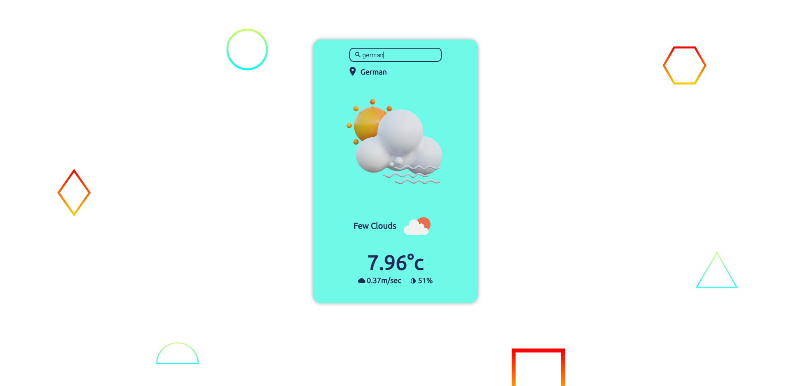

[](https://forthebadge.com)
[](https://forthebadge.com)
[](https://forthebadge.com)

# Weather App
-Check out the App **https://geek-weather.netlify.app/**

## Available Scripts

In the project directory, you can run:

### `npm install`

### `npm start`

Runs the app in the development mode.\
Open [http://localhost:3000](http://localhost:3000) to view it in your browser.

## screenshot of the app




## important code snippet

WeatherApi.js

```javascript

import axios from 'axios'

const url = 'https://api.openweathermap.org/data/2.5/weather?'
const apiToken = 'your token'

export const getWeather = (city) => axios.get(`${url}q=${city}&units=metric&appid=${apiToken}`)

```
WeatherAction.js

```javascript

export const fetchWeather = async (city) => {
    try {
        const {data} = await api.getWeather(city)
        return data
    } catch (error) {
        console.log(error)
    }
}

```
